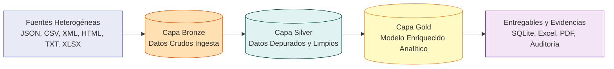

# EA4: Documentación de la Arquitectura y Modelo de Datos - Proyecto Integrador Big Data

**Institución Universitaria Digital de Antioquia (IU Digital)**  
**Programa:** Ingeniería en Software / Tecnología en Desarrollo de Software  
**Asignatura:** Arquitectura Big Data (7° Semestre)  
**Actividad:** EA4. Documentación de la Arquitectura y Modelo de Datos  
**Entregable Oficial:** [`docs/arquitectura_modelo.pdf`](docs/arquitectura_modelo.pdf)  

---

## 1. Descripción Global de la Arquitectura

Esta entrega final integra, documenta y consolida el ciclo de vida completo de los datos desarrollado a lo largo del **Proyecto Integrador de Big Data**. El sistema sigue el estándar de la **Arquitectura Medallion (Data Lakehouse)** distribuida en tres capas de madurez analítica:



### Fases Integradas del Proyecto:
1. **EA1 (Ingestión):** Extracción vía API REST / Carga base y almacenamiento en SQLite.
2. **EA2 (Preprocesamiento y Limpieza):** Depuración de >240,000 nulos, tipado, estandarización y normalización de variables.
3. **EA3 (Enriquecimiento Multiformato):** Integración relacional de 6 fuentes (JSON, CSV, XML, HTML, TXT, XLSX) con 100% de tasa de match y 44 columnas resultantes.
4. **EA4 (Documentación y Modelo de Datos):** Documento técnico exhaustivo en PDF con diagramas de flujo y diagrama Entidad-Relación (ER).

---

## 2. Estructura del Proyecto

El repositorio cumple estrictamente con la estructura solicitada para la Actividad 4:

```text
Tarea_4/
├── players_20.csv                    <- Dataset base (18,278 jugadores)
├── setup.py                          <- Empaquetado del proyecto
├── requirements.txt                  <- Dependencias completas del pipeline
├── README.md                         <- Documentación ejecutiva del proyecto
├── .gitignore                        <- Exclusiones de Git y temporales
├── .github/
│   └── workflows/
│       └── bigdata.yml               <- Workflow de CI/CD automatizado
├── src/
│   ├── data/                         <- 6 Fuentes multiformato complementarias
│   │   ├── countries_info.json       <- JSON (Países y Confederaciones)
│   │   ├── club_leagues.csv          <- CSV (Ligas y Divisiones)
│   │   ├── stadiums_info.xml         <- XML (Estadios y Capacidad)
│   │   ├── national_trophies.html    <- HTML (Títulos y Copas del Mundo)
│   │   ├── player_contracts_status.txt<- TXT (Contratos y Reputación)
│   │   └── sponsorship_tiers.xlsx    <- XLSX (Patrocinadores y Niveles)
│   ├── ingestion.py                  <- Script de Fase 1 (Ingesta)
│   ├── cleaning.py                   <- Script de Fase 2 (Limpieza)
│   ├── enrichement.py                <- Script de Fase 3 (Enriquecimiento)
│   ├── enrichment.py                 <- Alias de compatibilidad
│   ├── pipeline_master.py            <- Orquestador End-to-End maestro
│   ├── db/
│   │   └── ingestion.db              <- Base de datos analítica SQLite
│   ├── xlsx/
│   │   ├── ingestion.xlsx
│   │   ├── cleaned_data.xlsx
│   │   └── enriched_data.xlsx
│   └── static/
│       └── auditoria/
│           ├── ingestion.txt
│           ├── cleaning_report.txt
│           └── enriched_report.txt
└── docs/
    ├── arquitectura_modelo.pdf       <- DOCUMENTO TÉCNICO OFICIAL (PDF)
    ├── generate_diagrams.py          <- Generador de diagramas
    ├── generate_pdf_report.py        <- Compilador del documento PDF
    ├── diagrama_arquitectura.png     <- Diagrama de Flujo de Datos
    └── diagrama_modelo_er.png        <- Diagrama Entidad-Relación (ER)
```

---

## 3. Modelo de Datos Entidad - Relación (ER)

El modelo está concebido como un esquema analítico híbrido optimizado para minería de datos y Machine Learning:

| Tabla | Clave | Formato Origen | Cardinalidad | Rol en la Arquitectura |
| :--- | :---: | :---: | :---: | :--- |
| **`enriched_players`** | `sofifa_id` (PK) | SQLite (Gold) | Tabla Hechos / Maestra | Contiene 44 métricas analíticas por jugador. |
| **`countries_info`** | `nationality` (PK) | JSON | `1 : N` con Jugadores | Aporta continente, confederación y ranking. |
| **`club_leagues`** | `club` (PK) | CSV | `N : 1` con Jugadores | Aporta liga, país y prestigio de división. |
| **`stadiums_info`** | `club` (PK) | XML | `N : 1` con Jugadores | Aporta aforo y nombre de estadio. |
| **`national_trophies`** | `nationality` (PK) | HTML | `1 : N` con Jugadores | Aporta títulos mundiales y continentales. |
| **`player_contracts`** | `sofifa_id` (PK) | TXT | `1 : 1` con Jugadores | Aporta nivel salarial y estrellas de reputación. |
| **`sponsorship_tiers`** | `club` (PK) | XLSX | `N : 1` con Jugadores | Aporta marcas comerciales y categoría de patrocinio. |

---

## 4. Mapeo a Proveedores Cloud Reales

| Componente | Simulación Local | AWS | GCP | Azure |
| :--- | :--- | :--- | :--- | :--- |
| **Capa Bronze (Raw)** | `players_20.csv` | Amazon S3 Bucket | Google Cloud Storage | Azure Blob / ADLS Gen2 |
| **Capa Silver (ETL)** | Python / Pandas | AWS Glue / EMR | Cloud Dataflow / Dataproc | Azure Synapse Spark Pool |
| **Capa Gold (Analytics)** | `ingestion.db` | Amazon Redshift / Athena | Google BigQuery | Azure Synapse Analytics |
| **Orquestador CI/CD** | GitHub Actions | AWS Step Functions / MWAA | Google Cloud Composer | Azure Data Factory |

---

## 5. Instrucciones de Ejecución Local

### Prerrequisitos
- Python 3.9 o superior.
- Git.

### Paso 1: Clonar el repositorio
```bash
git clone https://github.com/TU_USUARIO/TU_REPOSITORIO.git
cd TU_REPOSITORIO
```

### Paso 2: Crear entorno virtual e instalar dependencias
- **En Windows:**
  ```bash
  python -m venv venv
  .\venv\Scripts\activate
  pip install -r requirements.txt
  ```

### Paso 3: Ejecutar el pipeline maestro y compilar la documentación
```bash
# 1. Ejecutar todas las fases de datos
python src/pipeline_master.py

# 2. Generar diagramas y compilar el documento PDF oficial
python docs/generate_diagrams.py
python docs/generate_pdf_report.py
```

---

## 6. Automatización con GitHub Actions

El workflow [`.github/workflows/bigdata.yml`](.github/workflows/bigdata.yml) se ejecuta automáticamente ante cada `push` o ejecución manual:
1. Configura el entorno virtual con **Python 3.11**.
2. Instala las dependencias necesarias.
3. Ejecuta el orquestador maestro `src/pipeline_master.py`.
4. Genera los diagramas y compila el documento técnico oficial `docs/arquitectura_modelo.pdf`.
5. Valida la integridad física de todos los entregables.
6. Publica el paquete completo de evidencias (`bigdata-architecture-ea4`) descargable desde la pestaña **Actions**.
